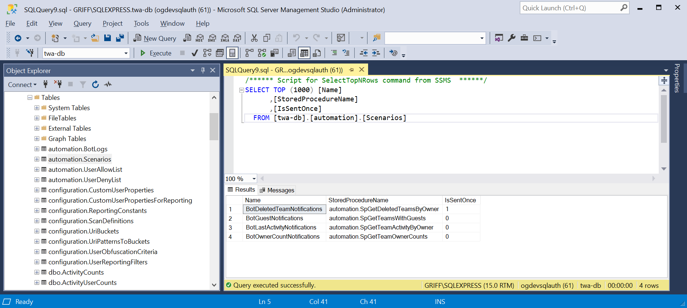
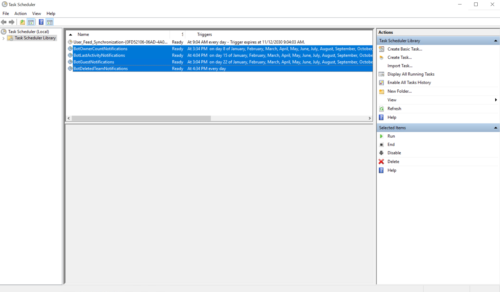

# Teamwork Analytics Automation - Configuring Scenarios

## Overview
Teamwork Analytics Automation (TWA Automation) has access to all of the data stored by TWA. Therefore it is possible to use this data and configure scenarios with. If the criteria is met in the scenario and returns data, then this will enable automated messages to be sent direct to users via email or Microsoft Teams. Several areas will need configuring for this, read on to find out how.

## Configuration
TWA Automation is deployed in two parts: a locally run Bot Notification Service, and a Modality-managed cloud solution that brokers and delivers messages to users. SQL Server is what the notification service will point to, Azure table storage is what the cloud solution will point to. 

### SQL Server
Everything related to TWA Automation is located within the TWA database which will be located within the "automation" schema, for example a table would be labelled as "automation.tablename". Anything outside of these schemas should not be tampered with. Only the areas specified in these docs should be configured by you and/or an admin.

#### Stored Procedures
There are already 4 existing stored procedures that will be visible within the TWA database, which work for the previously supported scenarios. Therefore, all of the data that was previously returned, is still returned but using this new architecture.

When creating a custom scenario, follow the steps below in order to create one that will be compatible with the solution:

1. Connect to the TWA Database
2. Create a stored procedure, ensure that it has a schema (prefix) of **"automation"**, for example **"automation.spNewScenario"**
3. It is important to the whole process, that the stored procedure **has to return** the following columns*
   1. UserId
   2. UserMailAddress
4. Any additional columns which are returned will be supported, but are not a requirement in order to function
5. Parameters are **not** supported, so do not add these e.g. automation.spNewScenario @Name nvarchar(30)
6. Run the SQL inside of the procedure and test that the data you expect is returned and that no errors occur
7. Use the code below (BotGuestNotifications Scenario) as a guide to writing your own custom scenario:

```sql
CREATE PROCEDURE [automation].[SpGetTeamsWithGuests]
AS
BEGIN
	SELECT 
		teams.[TeamID]
		,teams.[DisplayName] AS TeamDisplayName
		,teams.[LastActivity]
		,towners.[UserID] AS UserID
		,towners.[UserName] AS OwnerDisplayName
		,towners.[Mail] AS UserMailAddress
		,towners.[External] AS OwnerIsExternal
		,COUNT(tguests.[UserID]) AS GuestCount 
	FROM automation.Teams teams 
		JOIN automation.TeamUsers towners ON towners.[TeamID] = teams.[TeamID]
		JOIN automation.TeamUsers tguests ON tguests.[TeamID] = teams.[TeamID]
	WHERE 
		teams.IsArchived=0 
		AND towners.[External] = 0
		AND towners.[UserType] = 'Owner' 
		AND tguests.[DataType] = 'Guest'
		AND towners.[Anonymised] = 0
	GROUP BY
		teams.[TeamID]
		,teams.[DisplayName]
		,teams.[LastActivity]
		,towners.[UserID]
		,towners.[UserName]
		,towners.[Mail]
		,towners.[External]
END
GO
```

>*These columns **must** must return values and are case sensitive. If there are any rows that do not have a value for one of these properties, that row will be ignored and logged. Only valid rows will be sent to the cloud solution. Any additional columns that are returned will be processed.

#### Tables
Everything previously used by the old version of TWA Automation has been completely migrated over to the automation schema. The only new table which is required to be updated for configuration scenarios is **"automation.Scenarios"**.

This table contains the following columns:
* Name - This should match the parameter passed in by the notification service.
* StoredProcedureName - The name of the stored procedure which shall be searched for when the notification service runs.
* IsSentOnce - Represents whether an email/im will only be sent one time, unless content returned from the scenario changes.

By default, the following values should be populated in the table:


### Bot Notification Service
Now everything is setup in SQL, the next step is to add a new scheduled task on the machine where the bot notification service is located. 

The bot notification service, only processes 1 scenario, which is detected by a parameter passed into the service. This is why, once the ARM template has been deployed to a machine, there will be 4 scheduled tasks, all configured and set up to point to the scenarios configured in SQL. As seen below:


All that is required is for a new scheduled task to be created, pointing to the same executable as the other scheduled tasks. The only difference is that you will need to enter in the name value that you gave within the SQL DB. To do this, follow these steps:

1. Set up a new scheduled task/or re-use existing task by:
   1. Export existing task
   2. Import the exported task with the name of the your new scenario
2. Open your new task
   1. Click "Actions"
   2. Highlight the "Start a program" action
   3. Click "Edit"
   4. Update "Add Arguments (Optional)" parameter to be the same as the scenario name you entered in SQL.

> Make sure the task has "run when there is no one logged in" set.

> Ensure that the name matches exactly the same as the "name" column that you added into the Scenarios SQL table.

>Pay close attention to the scheduled times which you set-up for your task, take into account what your custom stored procedure is doing (for example, is the data over a specified amount of time) and set a reasonable time to run, also consider the remaining tasks scheduled times.

### Azure Table Storage
The final place to update is the **"ScenarioTemplates"** table located within table storage. This table has the following columns:
* PartitionKey - represents the tenant id
* RowKey - must match name of the scenario
* EmailSubject - the email subject which will display when the scenario sends an email
* EmailTemplate - the content which will display when the scenario sends an email
* TeamsCardTemplate - the content which will display when the scenario sends a Teams IM

>To note, if this table does not exist or is completely empty. The four default scenarios which mentioned above will still work regardless, therefore hardcoded values for the subject, teams card and email templates are all imbedded in the solution and will work with or without having values in this table. The same applies to missing rows.

>If you would like to customise the values for the default scenarios, simply update any of the existing rows and the changes will take effect when they're next triggered.

Email and card templates have two different specific formats they must be written in, here is an example of both for the BotGuestNotifications Scenario:

**Email Template:**
```html
<!DOCTYPE html>
<html lang="en">
<head>
    <style>
        th {
            text-align: left;
        }

        th, td {
            padding: 5px;
        }
    </style>
</head>
<body>
    <p>⚠ This is a notification that you are the owner of 1 or more teams in Microsoft Teams that have external users (guests). As an owner, please ensure that access is appropriate for the content being shared in that team.</p>
    <table style="width:100%">
        <tr>
            <th>Team</th>
            <th>Guests</th>
            <th>Last Activity</th>
        </tr>
        @foreach (var item in @Model.Notification.RowsWithAdditionalProperties)
        {
            <tr>
                @if (@item.Value.ContainsKey("TeamDisplayName"))
                {
                    <td>@item.Value["TeamDisplayName"]</td>
                }
                @if (@item.Value.ContainsKey("GuestCount"))
                {
                    <td>@item.Value["GuestCount"]</td>
                }
                @if (@item.Value.ContainsKey("LastActivity"))
                {
                    <td>@item.Value["LastActivity"]</td>
                }
            </tr>
        }
    </table>
    @if (@Model.BotInstallationLink != null)
    {
        <p>Would you prefer to be contacted via chat message in Microsoft Teams? Click <a href="@Model.BotInstallationLink">here</a> to install the Teamwork Tips Bot.</p>
    }
</body>
</html>
```

**Card Template:**

```json
{
  "$schema": "http://adaptivecards.io/schemas/adaptive-card.json",
  "type": "AdaptiveCard",
  "version": "1.0",
  "body": 
  [
    {
      "type": "TextBlock",
      "size": "default",
      "text": "Teams with Guests",
	  "weight": "Bolder",
      "wrap": true
    },
    {
      "type": "TextBlock",
      "size": "default",
      "text": "⚠ This is a notification that you are the owner of 1 or more teams in Microsoft Teams that have external users (guests). As an owner, please ensure that access is appropriate for the content being shared in that team.",
      "wrap": true
    },
    {
      "type": "Container",
      "style": "emphasis",
      "items": 
      [
        {
          "type": "ColumnSet",
          "columns": 
          [
            {
              "type": "Column",
              "width": 55,
              "items": 
              [
                {
                  "type": "TextBlock",
                  "text": "Team",
                  "weight": "Bolder"
                },
                                    @{
                                    int i = 0;
                                    foreach(var item in @Model.Notification.RowsWithAdditionalProperties) {
                                        if (++i > 1) {
                                            @:,
										}
										if (@item.Value.ContainsKey("TeamDisplayName"))
										{
										<text>
										{
										  "type": "TextBlock",
										  "text": "@item.Value["TeamDisplayName"]"
										}
										</text>
										}
									}
								}
							]
						},
						{
							"type": "Column",
							"width": 15,
							"items": 
							[
								{
									"type": "TextBlock",
									"text": "Guests",
									"weight": "Bolder"
								},
								@{
									int j = 0;
									foreach(var item in @Model.Notification.RowsWithAdditionalProperties) {
										if (++j > 1) {
											@:,
										}
										if (@item.Value.ContainsKey("GuestCount"))
										{
										<text>
										{
										  "type": "TextBlock",
										  "text": "@item.Value["GuestCount"]"
										}
										</text>
										}
									}
								}
							]
						},
						{
							"type": "Column",
							"width": 30,
							"items": 
							[
								{
									"type": "TextBlock",
									"text": "Last Activity",
									"weight": "Bolder"
								},
								@{
									int k = 0;
									foreach(var item in @Model.Notification.RowsWithAdditionalProperties) {
										if (++k > 1) {
											@:,
										}
										if (@item.Value.ContainsKey("LastActivity"))
										{
										<text>
										{
										  "type": "TextBlock",
										  "text": "@item.Value["LastActivity"]"
										}
										</text>
										}
									}
								}
							] 
						} 
					] 
				}
			]
		},
		{
			"type": "TextBlock",
			"size": "default",
			"text": "Thank you for your help.",
			"wrap": true
		}
	]
}
```

## Running Configured Scenario
Follow all the steps above should now mean that any user that meets the criteria for your scenario will receive a Teams IM or email when ran at the configured time.

If you wish to test your scenario immediately, simple connect to the machine where the scheduled tasks are configured and run the task. However, bear in mind that if all configured correctly - the users will receive a Teams IM or email.
